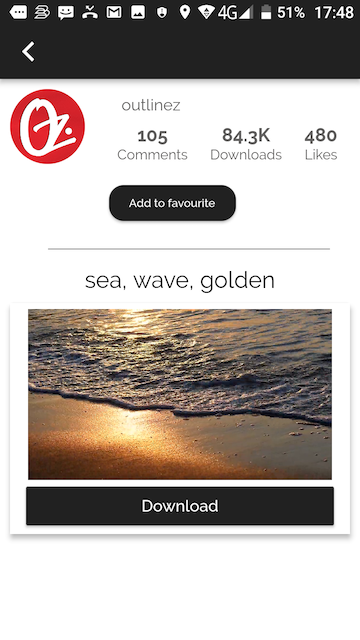
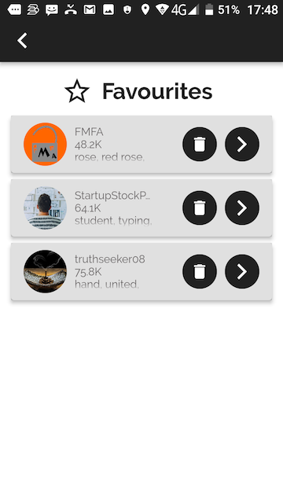

# flutter_showcase_app

Pixabay: A Flutter demo application.

##### `A showcase app for displaying image lists, developed on Flutter`.
##### `Uses BLOC pattern, SQFLite database, Streams, Repository pattern.`.

Overview
--------

App uses 'https://pixabay.com' APIs to display images & videos list. Developed with material design for both iOS & Android.





Features
--------

1. Search for images and videos
2. Detail page
3. Video Player
4. Image/Video downloader
5. Add to favourites


APIs
--------

This project relies on Pixabay API. You can add your own API in following file:

```dart
lib/constants/strings_const.dart

static const String API_KEY = "YOUR_API_KEY";
```