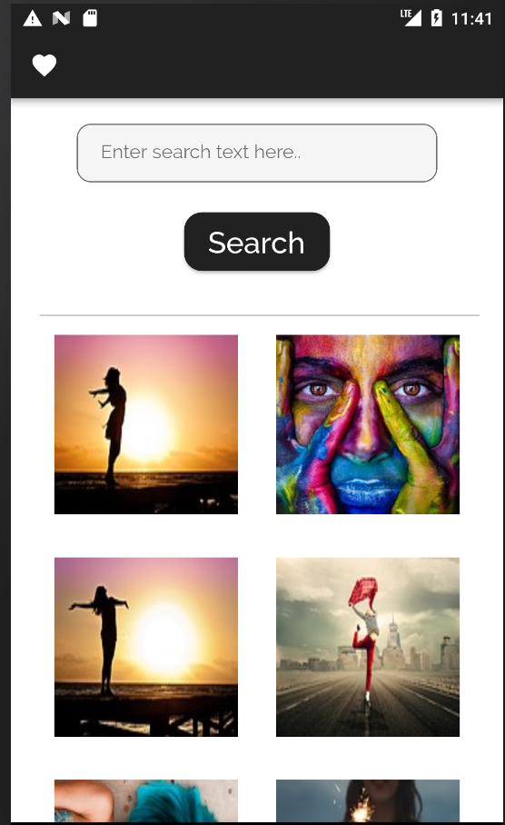
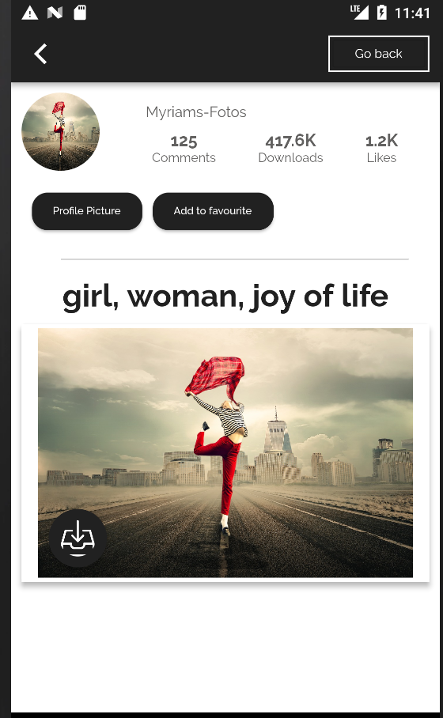

# flutter_showcase_app

Pixabay: A Flutter demo application.

##### `A showcase app for displaying image lists, developed on Flutter`.

Overview
--------

App uses 'https://pixabay.com' APIs to display images. Developed with material design for both iOS & Android. Uses BLOC pattern, SQFLite database.

Features
--------

1. Search for images
2. Detail page
3. Add to favourites